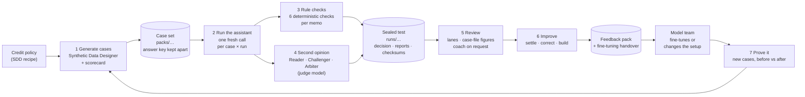

# Architecture

## Purpose

Banks refer loan applications their rules cannot auto-decide to a human
underwriter. An AI assistant may draft the briefing that person relies on. The
assistant does not decide the loan; it shapes what the underwriter sees.

A briefing can be fluent, correct in its conclusion, and still dangerous if it
leaves out the fact the decision turns on or states a number that is not in the
file. This system is an instrument for catching those failures by name, without
asking another model to judge them, and for producing a record a second-line
reviewer can inspect and re-derive.

Cases are generated from a declared process so the material facts are known
before the assistant is asked anything. That sealed knowledge is what makes
omission and fidelity checking possible.

The engine then closes the loop: people review what the checks found, their
answers become a feedback pack that improves the assistant, and a new test on
cases it has never seen proves whether it did. For running it, see
[setup](setup.md); for the screens, the [underwriter guide](underwriter-guide.md).

## The end-to-end flow



Each step, what it produces and where it lives:

| # | Step | What happens | Produces | Code |
|---|---|---|---|---|
| 1 | Generate cases | The Synthetic Data Designer draws applicants from the credit-underwriting recipe; a fixed scorecard decides each; the referred ones are kept, with the facts the decision turned on, the fields that must not count (decoys), and what would change the outcome | A case set: `items.jsonl`, `manifest.json`, the answer key (gitignored) | `src/sdd/` (vendored, served at `/sdd/`), `src/evidence/packs/`, `specs/credit_underwriting.yaml` |
| 2 | Run the assistant | Every case, each run, is one separate, stateless call: the task prompt as the system message, the case documents as the user message. Nothing carries over between calls | One transcript per memo, fingerprinted | `runner.py`, `adapters/nvidia_build.py` |
| 3 | Rule checks | Six checks mark every memo against the case file and the case's known facts. No model is involved, so the same memo always gets the same result | `results.jsonl`; per check a pass rate, and how many cases got different results between runs | `checks/`, `aggregate.py` |
| 4 | Second opinion (optional) | Three agents on the judge model: a Reader scores the memo as an underwriter would; a Challenger checks it against the case file with tools and the engine's reference figures; an Arbiter decides and flags memos for a person | `panel/records.jsonl` and every agent's conversation | `panel.py`, `panel_run.py`; in the NemoClaw sandbox via `scripts/cluster/panel_nemoclaw.sh` |
| — | Seal and decide | The results become a decision against the bank's thresholds (GO / GO WITH CONDITIONS / NO-GO), root causes, recommendations and one report per reader; every file is hashed into `checksums.sha256` | `evidence/`, `checksums.sha256` | `evidence/` |
| — | Anchor | The seal's fingerprint goes into the Bitcoin blockchain through OpenTimestamps, when the test finishes and each time a feedback pack is built. Standalone; `EVIDENCE_ANCHOR=off` turns it off ([anchoring](anchoring.md)) | `anchors/` in the test, outside its seal | `anchor.py` |
| 5 | Review | Memos are sorted into lanes (both the checks and the AI reviewers flagged / one of them / neither). A person answers each finding: is the memo wrong here? The screen sets the case file's figures beside the memo and each finding; the coach answers only when asked | `review/records.jsonl`: answers, reasons, corrections, first answers, the coach conversation | `review.py`, `facts.py`, `coach.py` |
| 6 | Improve | Model risk settles disagreements; people write the corrected wording of confirmed mistakes; the feedback pack is built from settled answers only | `feedback/`: corrected memos, before-and-after pairs, finding labels, rule-check fixes, and the fine-tuning handover zip | `review.py` (`labels`, `to_correct`, `build_feedback`, `build_handover`) |
| 7 | Prove it | A change (the bank's own, such as handing the assistant its computed figures, or a fine-tuned model) is tested on new cases: as it is and with the change, same cases, compared case by case | Two sealed runs and a comparison: ACCEPT / REJECT / INCONCLUSIVE / NO EFFECT | `evidence/compare.py`; the re-test job in `web/app.py` |
| 7b | Nothing else broke | The capability checker runs NVIDIA NeMo Evaluator on the current and the changed model: arithmetic, maths in eleven languages, knowledge, and the credit memo benchmark (the six checks decide; a judge is recorded beside them); `nel compare` and `nel gate` decide GO / NO-GO / INCONCLUSIVE under a release policy ([capabilities](capabilities.md)) | Sealed, anchored result folders and a gate report | `capabilities.py`, `nemo/` |

What keeps the evidence honest:

- **No production data.** Every case is generated; nothing personal is in a test, a review
  or a feedback pack.
- **The answer key never reaches a model.** The assistant, the AI reviewers and the coach
  see the case documents only. The checks and the review's agreement figures use the key.
- **Sealed and re-derivable.** A review, a ruling, a correction or a rebuilt pack re-seals
  the run; `evidence verify --recompute` re-runs every check from the transcripts.
- **Anchored outside our control.** The seal is anchored in Bitcoin, so not even we can
  change a memo or a check result and seal it again without it showing; anyone can check
  the proof with the official OpenTimestamps client.
- **Repeats measure consistency.** A case run more than once shows whether the assistant
  answers the same way; the decision adds a condition when more than 10% of cases change
  result between runs.
- **Human answers stay human.** The coach speaks only when asked, and the review records the
  first answer on each finding before it did, so its influence is measured, not hidden.

## Where the models run

| Role | Model | Used by |
|---|---|---|
| Assistant | Nemotron 3.5 Lightning | Step 2: the system under test |
| Judge | Nemotron 3 Super 120B-A12B | Step 4 (the three agents), the coach, the readability judge |
| Embedder | Nemotron 3 Embed 1B | Retrieval over regulation texts for the judge's citations |

Each role is an OpenAI-compatible endpoint: NVIDIA's cloud, or NIMs on the team's GPU node
(`scripts/cluster/servers.sbatch`, see [cluster.md](cluster.md)). A small relay
(`stream_relay.py`) streams the judge's replies to the sandbox and spreads the panel's calls
over a second judge when one is running.

## Parts

| Part | Module | Responsibility |
|---|---|---|
| Case generation | `src/evidence/packs/`, `specs/` | Generate applications, decide them with a scorecard, attribute drivers and decoys, render documents, emit a pack |
| Contracts | `src/evidence/contracts/` | The item, the transcript, the check result, the regulatory context and assessment |
| Checks | `src/evidence/checks/` | Deterministic marking against the item's reference lists; no model in the verdict |
| Model access | `src/evidence/adapters/` | One client for NVIDIA Build and any OpenAI-compatible NIM; retrieval over the case file |
| Runner | `src/evidence/runner.py` | Items × repeats → transcripts; resumable; writes the run manifest |
| Judge | `src/evidence/judge.py` | Readability and oversight against retrieved regulation passages, with a required citation; reported, not gated |
| Corpus | `src/evidence/corpus.py`, `regulations/<CC>/corpus.yaml` | Standalone build: source texts → passages → Milvus Lite index, hashed; the judge retrieves from it at run time |
| Regulations | `src/evidence/regulations.py`, `regulations/` | Jurisdiction rule packs: evidence-presence checks selected by the pack's regulatory context |
| Evidence | `src/evidence/evidence/` | Aggregation by obligation, the report, checksums, the verifier |
| CLI | `src/evidence/cli.py` | `evidence run · report · verify · rules · checks · ui` |
| Judge panel | `src/evidence/panel.py`, `panel_run.py` | The second opinion: Reader, Challenger (with tools), Arbiter; standard library only, so the same file runs in the engine or a NemoClaw sandbox |
| Review | `src/evidence/review.py` | The review queue and its lanes, verdicts, rulings, corrections, the feedback pack and the fine-tuning handover |
| Case facts | `src/evidence/facts.py` | The figures a memo turns on, read from the case file and worked out exactly, and which of them each finding is about |
| Coach | `src/evidence/coach.py` | An on-request conversation with the judge model about a reviewer's answers; never sees the answer key |
| Case designer | `src/sdd/` | The Synthetic Data Designer, vendored from its own repository (`scripts/sync_sdd.sh`) and served at `/sdd/` |
| Web UI | `src/evidence/web/` | A thin FastAPI layer over the same functions; static HTML, no build step. Home → Test → Review → Improve, plus case sets and earlier tests; tests and re-tests run on worker threads, are polled, and can be stopped. The full console is at `/advanced/` |

Generation never scores briefings. Marking never invents what "material"
means. Model access never sees scorecard internals — only the documents and the
task.

## Flows

### Build a pack

```
declared credit process (SDD spec)
    → synthetic applications
    → deterministic scorecard
    → keep the referred cases
    → attribute drivers / decoys / omission targets / flip levers
    → render application + bureau report + lending policy
    → items.jsonl + manifest + obligations map (+ regulatory context)
```

Each item carries the prompt, the documents, which checks apply, and the
reference lists those checks resolve against. Threshold maths, contributions
and margins stay in a gitignored answer key.

### The gate, no model

```
one item → its documents → what a briefing must surface
    → briefing A: every word true, deciding fact omitted
    → briefing B: deciding fact surfaced
    → material_omission on each → pass / fail, which refs were found
```

`scripts/demo_gate.py`. Nothing here calls a model; the catch is comparison
against known required facts.

### A run

```
pack × repeats
    → assistant call per (item, repeat), recorded as a transcript
    → every declared check on the output → results.jsonl
    → readability judge on the output → results.jsonl (not gated)
    → jurisdiction rule pack on the regulatory context → regulations.json
    → manifest: pack sha, model ids, endpoints, prompt hashes, seeds, git commit
    → evidence/: report by obligation, summary, obligations map
    → checksums.sha256 over everything
```

A transcript that already exists is reused, so a killed run continues and a
finished run re-scores without model calls. When retrieval is used, the
transcript records what was retrieved, so an omission after a missed paragraph
is attributable to retrieval rather than to the model.

### Verify

```
checksums.sha256 → every file re-hashed; missing, changed and unlisted files named
--recompute       → every deterministic check re-run from the transcripts and
                    compared with results.jsonl
```

## Marking a briefing

```
briefing text + item
    → for each named check
        → resolve against the item's reference lists
        → uniform result: passed, score, detail, evidence, needs_audit
```

| Check | Question | Passes when |
|---|---|---|
| `material_omission` | Did it state every fact the decision turned on? | All required facts found: exact, or by constrained similarity (flagged for audit) |
| `numeric_fidelity` | Is every number in the briefing in the file, or one arithmetic step from it — never a monthly figure over an annual one? | No ungrounded number |
| `comparison_fidelity` | Does every comparison it states hold ("652 is below 600")? | No false comparison between two figures |
| `claim_consistency` | Does its own figure support the breach it claims ("exceeds 40%" … "33.2%")? | No limit claim contradicted by a figure it states |
| `decoy_citation` | Did it cite a field with no bearing on the outcome as a reason? | No decoy in a sentence with a reasoning cue; the age of a credit file or account is not the age band |
| `flip_accuracy` | Did it name what would change the outcome, and which way? | Every flip lever — or another lever that cures the same breach — named with its direction |

Further checks register the same way: name on the item → function → uniform
result.

## Design rules

1. Omission is arithmetic, not judgement.
2. Selection is observable: what the assistant read is part of the transcript.
3. Soft matches are counted and flagged, never hidden.
4. One instrument, two briefing sources: hand-written controls and live model
   output face the same checks.
5. Local and offline first: pack build, the gate, marking and verification run
   without a network; models are the one stage that needs one.
6. The judge never grades completeness or correctness.
